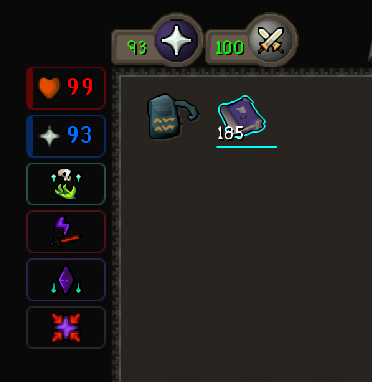

# PvM HUD

Compact overlay for the combat information you check constantly: HP, Prayer, special attack, spell states, and important cooldowns.

PvM HUD is designed to stay small, readable, and draggable so it can sit near your focus point without covering anything.

### Chips layout that pairs well with Compact Orbs, with readable stats and spells that only appear when active.

## Features

- Tracks boosted Hitpoints, Prayer, special attack, poison, and venom.
- Tracks Thrall, Vengeance, Death Charge, Mark of Darkness, Corruption, Ward of Arceuus, and Heart cooldowns.
- Includes Text, Game Icons, Bars, Chips, Orbs, and Stack HUD styles.
- Supports horizontal and vertical layouts.
- Optional local-only overhead alerts for low HP and low Prayer.
- Configurable thresholds, fonts, spacing, opacity, flash behavior, and colors.

## HUD Styles

- Text: minimal letter labels.
- Game Icons: compact layout using RuneScape-style icons.
- Bars: HP, Prayer, and spec bars with spell/cooldown tiles.
- Chips: readable stat chips with compact spell icons.
- Orbs: circular stat readouts with grouped spell/cooldown tiles.
- Stack: narrow vertical list for tucking beside other overlays.

## Tracked States

- Stats: boosted HP, boosted Prayer, special attack, poison, venom, low-threshold alerts.
- Thrall: summon timer, cooldown, expiry warning, and early clear when your tracked thrall despawns.
- Vengeance: active and cooldown.
- Death Charge: ready, active, consumed, cooldown, and expiry warning.
- Mark of Darkness: active, expiring, and faded.
- Corruption: cooldown.
- Ward of Arceuus: estimated active duration and cooldown.
- Heart: shared Imbued/Saturated Heart cooldown.

## Notes

- Overhead alerts are local-only; they set your local player overhead text and do not send public chat.
- Thrall and Ward of Arceuus expiry warnings are estimates.
- Enable `Master CA thralls` if you have the Master Combat Achievement thrall duration reward.
- Corruption currently tracks cooldown state only.

## Changelog

### v1.2

- Improved Thrall tracking so teleports can clear the active thrall state when your tracked thrall despawns.
- Reworked Thrall state handling to use summon chat/cooldown as the timer source and NPC despawn only for early clears.
- Reduced false clears from other players' thralls and unrelated NPC despawns.
- Removed stale Thrall active-varbit dependency.

### v1.1

- Added HUD style selector.
- Added Game Icons, Bars, Chips, Orbs, and Stack HUD styles.
- Added horizontal and vertical compact layouts.
- Added local-only low HP and low Prayer overhead alerts.
- Added expanded font, spacing, sizing, opacity, threshold, flash, and color controls.
- Improved compact layout alignment and text fitting.
- Fixed overhead alerts sticking above the player.
- Fixed bar-style spell backgrounds ignoring opacity.
- Cleaned up overlay rendering and icon caching.
