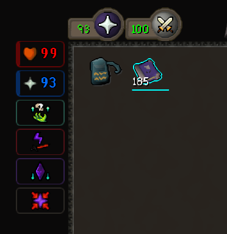

# PvM HUD

Compact, draggable overlays for the combat information you check constantly: Hitpoints, Prayer, special attack, spell states, cooldowns, potion timers, and combat boosts.

Chips layout that pairs well with the default RuneLite orbs, with readable stats and spells that only appear when active.

---

## Features

- Tracks boosted **Hitpoints, Prayer, Special Attack, poison, and venom**
- Tracks **Thrall, Vengeance, Death Charge, Mark of Darkness, Corruption, Ward of Arceuus, and Heart**
- Tracks **CoX overload, ToA salts, and divine combat potion timers** in a separate draggable overlay
- Tracks **Attack, Strength, Defence, Ranged, and Magic boosts** in a separate draggable overlay
- Main HUD styles: **Text, Game Icons, Bars, Chips**
- Potion and boost overlay styles: **Game Icons, Chips**
- Supports **horizontal and vertical layouts**
- Optional **local-only overhead alerts** for low HP/Prayer, Spec threshold, expiring potions, expired potions, and low combat boosts
- Highly configurable: **thresholds, colours, spacing, fonts, opacity, flashing**

---

## HUD Styles

- **Text** — minimal text-only layout  
- **Game Icons** — spell icons + stat icons with values  
- **Bars** — HP/Prayer/Spec bars with spell tiles  
- **Chips** — compact stat blocks with icons  

Potion and combat boost overlays use the compact **Game Icons** and **Chips** styles.

---

## Tracked States

- **Stats** — boosted values, poison/venom, threshold alerts  
- **Potion timers** — CoX overload, ToA salts, and divine combat potion timers with combo-potion dedupe
- **Combat boosts** — Attack, Strength, Defence, Ranged, and Magic boost amount, remaining boost percentage, and low-boost alerts
- **Thrall** — duration, cooldown, expiry warning, reliable recast tracking  
- **Vengeance** — active + cooldown  
- **Death Charge** — active, consumed, cooldown, expiry warning  
- **Mark of Darkness** — active, expiring, faded  
- **Corruption** — cooldown  
- **Ward of Arceuus** — active duration (estimated) + cooldown  
- **Heart** — shared Imbued/Saturated cooldown  

---

## Changelog

See [CHANGELOG.md](CHANGELOG.md) for release history.
