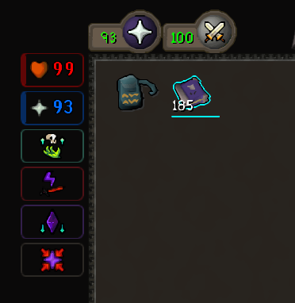

# PvM HUD

Compact, draggable HUD for the combat information you check constantly: Hitpoints, Prayer, special attack, spell states, and cooldowns.

---

## Features

- Tracks boosted **Hitpoints, Prayer, Special Attack, poison, and venom**
- Tracks **Thrall, Vengeance, Death Charge, Mark of Darkness, Corruption, Ward of Arceuus, and Heart**
- Main HUD styles: **Text, Game Icons, Bars, Chips**
- Supports **horizontal and vertical layouts**
- Optional **local-only, color-configurable overhead alerts** for low HP/Prayer, the Spec threshold, buff expiry, and cooldown readiness
- Highly configurable: **thresholds, colours, spacing, fonts, opacity, flashing**

---

## HUD Styles

- **Text** — minimal text-only layout  
- **Game Icons** — spell icons + stat icons with values  
- **Bars** — HP/Prayer/Spec bars with spell tiles  
- **Chips** — compact stat blocks with icons  

## Tracked States

- **Stats** — boosted values, poison/venom, threshold alerts  
- **Thrall** — duration, cooldown, expiry warning, reliable recast tracking  
- **Vengeance** — red skull while active; white Vengeance Other skull after consumption, through cooldown and the configured ready visibility time
- **Death Charge** — active, consumed, cooldown, expiry warning  
- **Mark of Darkness** — active, expiring, faded  
- **Corruption** — cooldown  
- **Ward of Arceuus** — active duration (estimated) + cooldown  
- **Heart** — shared Imbued/Saturated cooldown  

---

## Development

See [development guidelines](CONTRIBUTING.md) for RuneLite plugin rules.
